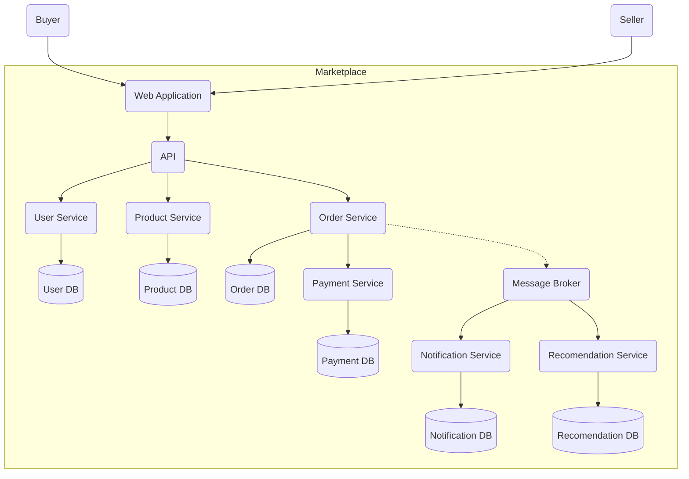

Диаграмма

Инструкция по запуску сервиса

1. Выполнить в командной строке команду `docker build -t marketplace .`
2. Выполнить после этого команду `docker run -p 8080:8080 marketplace`
3. Проверить, что сервис работает одним из способов
   1. Перейти через браузер на `http://localhost:8080/health`
   2. Выполнить в командной строке `curl http://localhost:8080/health`
