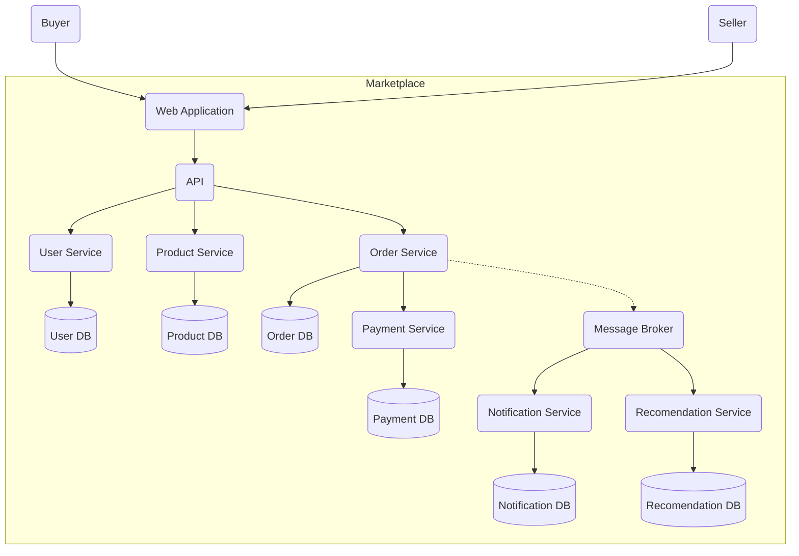

Диаграмма

Домены маркетплейса
1. Пользовательский домен — отвечает за аутентификацию и авторизацию пользователей, их профили на маркетплейсе
2. Домен товаров — отвечает за каталог товаров с данными о ценах, остатке, характеристиках
3. Домен заказов — отвечает за создание, обработку и завершение заказа
4. Домен оплаты — отвечает за проведение оплаты в рамках жизненного цикла заказа
5. Домен персонализации — отвечает за рекомендации товаров пользователям на основе их действий на маркетплейсе
6. Домен уведомлений — отвечает за уведомление пользователей о чем-либо

Я решил исходить из принципа один микросервис на каждый домен
1. Сервис пользователей — хранит данные о пользователях (логин - пароль для авторизации) и их роли (продавец / покупатель)
2. Сервис товаров — хранит данные обо всех товарах, имеющихся на маркетплейсе
3. Сервис заказов — хранит данные о заказах и отвечает за весь их жизненный цикл от создания до завершения
4. Сервис оплаты — хранит данные об оплатах и отвечает за весь цикл их проведений
5. Сервис персонализации — хранит данные, необходимые для расчета рекомендаций каждому из пользователей
6. Сервис уведомлений — хранит уведомления, которые должен разослать, и отвечает за их рассылку
7. API Gateway — единая точка входа для фронтенда. Отвечает за маршрутизацию запросов к нужным сервисам
8. Брокер сообщений — посредник между сервисами, передающий события для рекомендаций / рассылки уведомлений

Взаимодействия сервисов
1. Синхронное — API со всеми связанными сервисами
2. Синхронное — сервис заказов с сервисом оплаты
3. Асинхронное — сервис заказов отгружает события в брокер сообщений
4. Синхронное — брокер рассылает события из сервиса заказов в сервисы рекомендаций и уведомлений

Архитектурные варианты декомпозиции
Вариант 1: Модульный монолит — все домены живут в одной единице деплоя, имеют общую БД
Плюсы: быстрое развертывание, отсутствие проблем с межсервисными транзакциями
Минусы: сложно масштабировать, наличие единой точки отказа сервиса, невозможность независимого деплоя

Вариант 2: Микросервисная архитектура — каждый домен живет в своей микросервисе со своей базой данных
Плюсы: независимое масштабирование, отсутствие единой точки отказа
Минусы: проблемы с межсервисными транзакциями, сложнее поддерживать инфраструктурно

Инструкция по запуску сервиса
1. Выполнить в командной строке команду `docker build -t marketplace .`
2. Выполнить после этого команду `docker run -p 8080:8080 marketplace`
3. Проверить, что сервис работает одним из способов
   1. Перейти через браузер на `http://localhost:8080/health`
   2. Выполнить в командной строке `curl http://localhost:8080/health`
